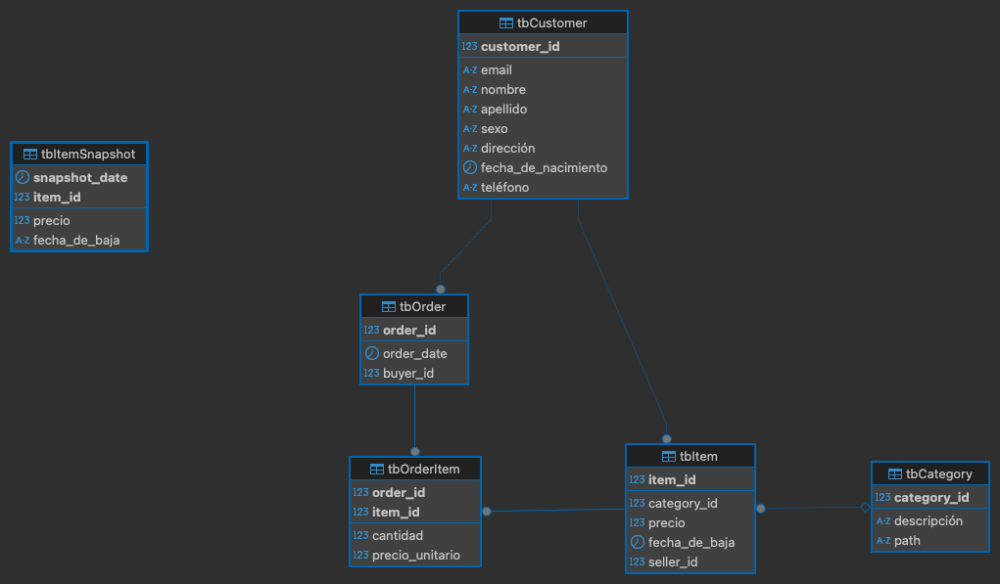

# Meli

## Challenge Engineer - Primera Parte - SQL

Abaixo descrevo o processo realizado para solucionar esta etapa do Challenge.

1. Desenhar o DER
   
    Analisando as tabelas propostas: Customer, Item, Category e Order, senti a necessidade de criar a tabela OrderItem. Esta tabela relaciona as Orders com os Itens.
    

2. Criar as tabelas

   [02_create_tables.sql](sql/02_create_tables.sql)

3. Respostas

   [04_respuestas_negocio.sql](sql/04_respuestas_negocio.sql)
